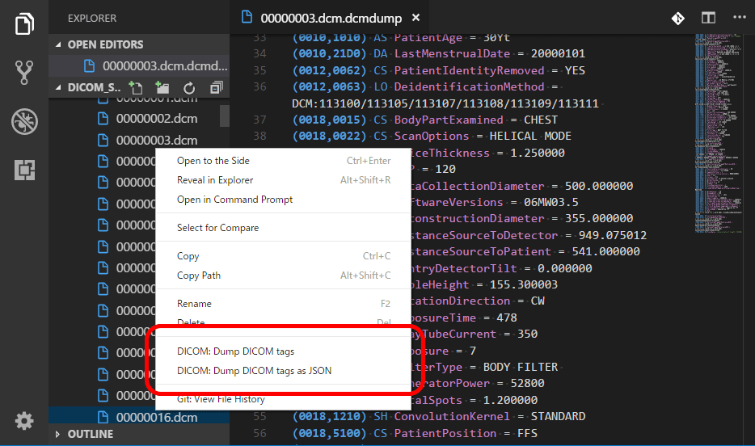

# DICOM Dump for Visual Studio Code

A [Visual Studio Code][vsc] (vscode) extension that dumps DICOM tag contents.

[vsc]: https://code.visualstudio.com/

## Usage



Use the context menu on the DICOM file and select "DICOM: Dump DICOM tags".

## Features

- Dumps all DICOM tags in human-readable format (except binary data).
- Understands value representation (VRs) of most standard DICOM tags.
- Basic support for character encodings.
- 100% JavaScript. Does not require any external binary dependencies like DCMTK.

## Configuration

- `dicom.showPrivateTags` (default = `false`) controls the
  visibility of DICOM private tags. Set this to `true` to dump everything.
  Note that many private tags have 'UN' (unknown) VR type, which means
  this extension does not know how to stringify them.

- `dicom.dictionary` modifies or adds entries to
  the standard DICOM dictionary. Example:

  ```json
  {
    "dicom.dictionary": {
      "01F51247": { "vr": "US", "name": "myPrivateNumericalTag" },
      "01F51248": { "vr": "LO", "name": "myPrivateTextTag", "forceVr": true }
    }
  }
  ```

  `forceVr: true` will forcibly overwrite the VR type even if
  another type is explicitly specified in the DICOM file.
  This may allow you to sniff the contents of some private tags.

## Troubleshooting

**My DICOM file does not load at all!**: Can you open that file with [dicom-parser's online demo][demo]? If not, probably your DICOM file is not standard-compliant, and there is little I can do. Some DICOM implementations are tolerant enough to open mildly broken files. Just because you can view your file with &lt;insert your favorite viewer here&gt; does not mean the file is not corrupted. If you could open the file with the demo above and are still getting an error from this extension, feel free to report as a bug.

[demo]: https://github.com/cornerstonejs/dicomParser

**The "Dump DICOM tags" context menu doesn't show up!**: Your DICOM file must have the extension `*.dcm` or `*.dicom`. Please let me know if you know other famous file naming conventions. Currently, VS Code cannot properly guess the type of a binary file based on its contents.

**Patient/Institution Name is garbled!**:

## Known Issues / Limitations

**USE AT YOUR OWN RISK. DO NOT USE THIS FOR CLINICAL PURPOSES.**

- Does not work with remote workspaces mounted with `FileSystemProvider` (blocked by: microsoft/vscode#48034).
- It's not possible to modify DICOM files.
- Character encoding support is limited, and it lacks Korean character support.
  PRs are welcome.

## Bugs / PRs

Use GitHub's issue system.

## Acknowledgement

This extension is based on the following awesome packages.

- [dicom-parser][parser]
- [dicom-data-dictionary][dictionary]

[parser]: https://www.npmjs.com/package/dicom-parser
[dictionary]: https://www.npmjs.com/package/dicom-data-dictionary
